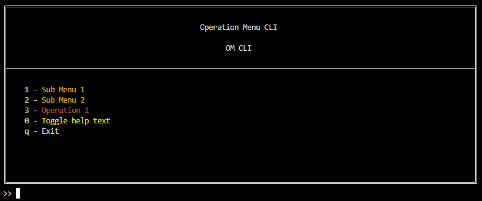

# OM CLI Framework

## Table of Contents
1. [Introduction](#introduction)
2. [Installation](#installation)
3. [Configuration](#configuration)
4. [Usage](#usage)
5. [Commands](#commands)
6. [Logic flow of the system](#logic-flow-of-the-system)
9. [License](#license)


## Disclaimer
The OM CLI documentation is in an early stage and is prone to change.

## Introduction
The OM CLI (Operation Menu Command Line Interface) is a terminal-based tool designed to provide a user-friendly, menu-driven interface for executing various operations, such as API calls.  
It allows users to interface with different systems and present information in a way that suits their needs.  
The menu structure and the operations are defined using configuration files, making it highly customizable.



## Installation
Clone the project and install the required dependencies.

```bash
git clone https://github.com/ComposeDev/om-cli
cd om-cli
python3 -m venv .venv
source .venv/bin/activate
pip install -r requirements.txt
chmod +x run_cli*
```

### Test Usage
```bash
./run_cli_test.sh
```

## Configuration
The OM CLI system use multiple configuration files to define the operations and API endpoints that can be executed.
It can also load Action Packs to extend the available actions.

### Operation tree configuration
Information on how to configure the operation tree can be found [here](documentation/om_tree.md).

### API definitions
Information on how to configure API definitions can be found [here](documentation/api_definitions.md).

### Action Packs
Information on how to use Action Packs can be found [here](documentation/action_packs.md).

## Commands
The OM CLI can be used in two ways: Interactive mode and by parameter based command execution.

It supports a couple of generic parameters used to control the behavior of the system.
 - **-l** or **--log_level**:
    Set the log level of the system.
    Possible values are **DEBUG**, **INFO**, **WARNING**, **ERROR**, **CRITICAL**.
    Default is **INFO**.
 - **-c** or **--custom_path**:
    The path to the custom configuration directory.
    Used when you want to load the custom configuration from a non default path.
 - **-t** or **--tree_path**: 
    The path to the OMTree configuration file.
    Used when you want to load the OMTree configuration from a non default path.
 - **-m** or **--mock_api_responses_file_path**:
      The path to the file containing mock API responses.
      Used when you want to load mock API responses instead of using a real API.
      Mostly used for testing and debugging.
 - **-s** or **--skip_looping**:
    Skip the looping behavior of the system.
    This is useful when running the OM CLI in the Parameter based command execution mode.
 - **-g** or **--generate_tree**:
    Generate a new OMTree configuration file from the current OMTree.
    Used when debugging and want to reconstruct the OMTree configuration file.
 - **-o** or **--operation**:
    Execute an Operation directly from the command line.
    Example: `om_cli -o operation_name`
 - **\*params**:
    Provide params/arguments for the command to be executed.
    If a argument does not begin with a dash, it is considered a param for the command.
    If the argument value is a string, it should be enclosed in double quotes.
    All params should be provided in the format `param_name=value`.
    Example: `om_cli -o operation_name param1=value1 param2="value2"`
    Example2: `om_cli -o operation_name param1=value1 param2="value2" -l DEBUG`

### Interactive mode
When using the interactive mode, the user is presented with a menu-driven interface that allows them to navigate through the operation tree and execute commands.

### Argument based command execution
This mode is made for executing operations directly from the command line, without having to navigate through the menu.
It is accessed by providing the operation and its parameters as arguments when starting the OM CLI.

## Logic flow of the system
### Interactive mode:

1. Start the OM CLI system
2. Load the Custom configuration files
3. Display the main menu
4. User selects an Operation or submenu
6. If the Operation has sub-Operations, display the submenu
7. If the Operation has Actions, execute the Actions
8. Process the Actions in order
9. If an Action uses input Parameters, prompt the user for input or use previous Parameter values
10. Process the Action
11. If the Action needs additional input, prompt the user for input
12. The action might generate output parameters
13. When all actions are executed, display the result with a generated command for repeating the operation without the need for using the interactive mode
14. Return to the main menu

### Parameter based command execution:

1. Start the OM CLI system using the -o/--operation argument

## License

This project is licensed under the MIT License. See the [LICENSE](LICENSE) file for details.

### Third-Party Licenses

This project includes third-party dependencies with the following licenses:
- Apache Software License [Apache-2.0](LICENSES/APACHE_LICENSE.txt)
- Mozilla Public License [MPL-2.0](LICENSES/MPL_LICENSE.txt)

See the [LICENSES](LICENSES) directory for details.